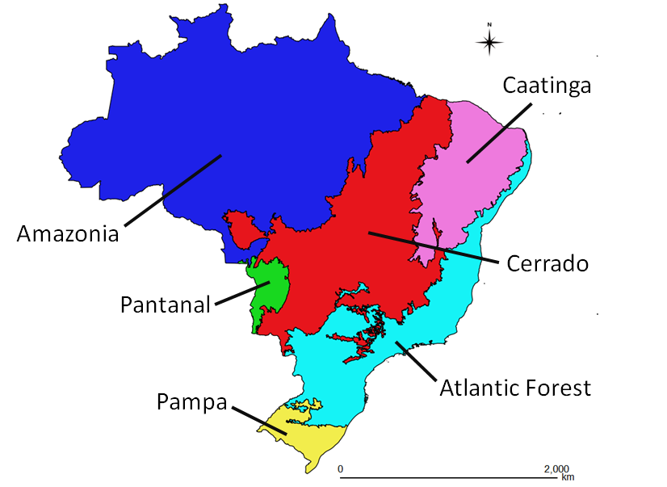
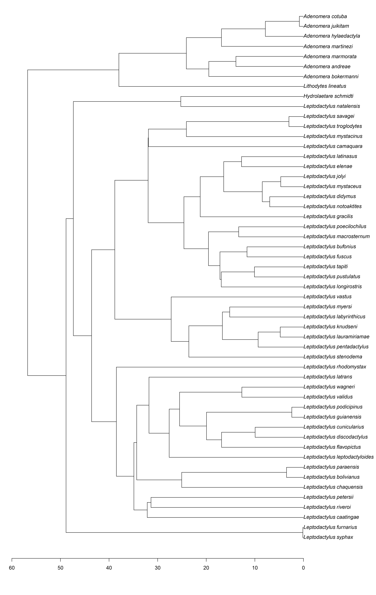
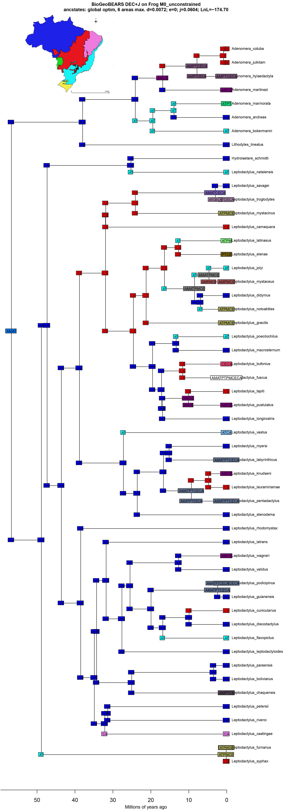
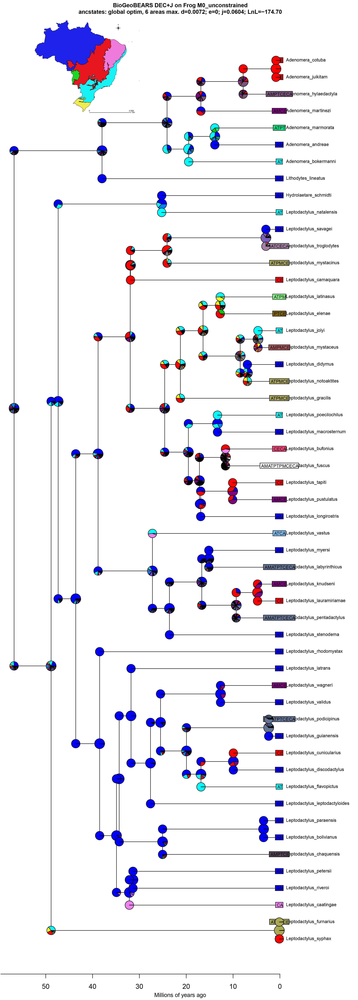
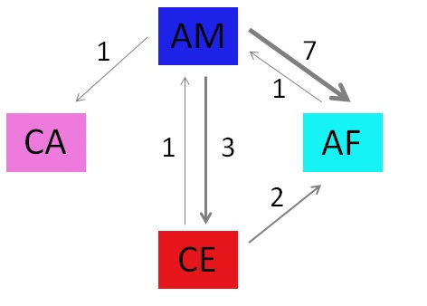
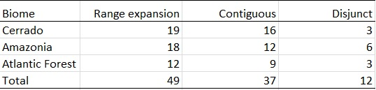
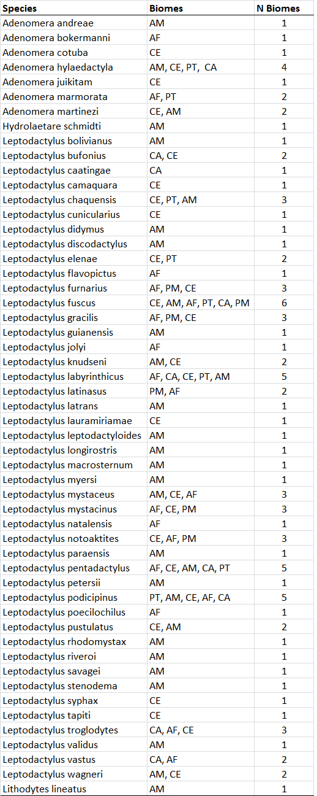

# Phylogenetic Biology - Final Project

# Biogeography of neotropical anurans of the subfamily Leptodactylinae in Brazil

## Introduction and Goals
Lineages that are widespread over large and heterogeneous areas often exhibit phenotypic divergence throughout their geographical range. Although some of this divergence may be the result of genetic drift, different environmental conditions across the range present different selective pressures that can ultimately lead to  phenotypic evolution as a result of differential fitness associated with trait variation (Gouveia et al. 2019). Amphibians are ectothermic animals with permeable skins, and therefore they must behaviorally and physiologically maintain their hydrothermal balance in order to persist in an area, making them highly dependent on environmental conditions. Physiological evolution is a complex process and may be influenced by constrains arising from adaptations of the organism's ancestors to their original range. Therefore, understanding the biogeographic history of lineages is important for investigating their physiological evolution.
The subfamily of anurans Leptodactylinae is widespread, and occurs from southern North America to southern South America, in Brazil there are representatives of this lineage in all six recognized biomes - Amazonia, Cerrado, Caatinga, Pampa, Atlantic Forest and Pantanal (Figure 1) and some species exhibit geographic ranges that span over several biomes (Figure S1).

.
**Figure 1** Map of the six Brazilian biomes.

Amazonia and Atlantic Forest are disjunct tropical rainforests, currently separated by the Cerrado and Caatinga, which exhibit lower mean annual precipitation and higher precipitation seasonality, serving as barriers to many forest species susceptible to desiccation. However, the two forests have been connected by forest bridges many times since the lifting of the Andes 45 million years ago as evidenced by pollen analyses, niche modelling, and splits between lineages inhabiting both forests (Sobral-Souza et al. 2015, Ledo & Colli 2017). Some Leptodactylinae species occur both in the Amazon and Atlantic Forest, and phylogeographic work has demonstrated a series of colonization events, from tens of millions of years ago through the late Pleistocene (Fouquet et al. 2014).

 The two rainforests extend through large geographical areas and encompass a suite of temperature and precipitation conditions, which makes these forests an ideal system to test hypotheses about physiological evolution. With information about the geographical origin, distribution, and ecology of widespread lineages of anurans throughout these regions, we can ask how thermal and water balance physiology has responded to, or itself influenced the evolution of lineages. The success of anurans of the subfamily Leptodactylinae in colonizing areas with very different climatic regimes makes them good candidates to test hypotheses about physiological evolution within anurans. Therefore, the objective of this project is to model the biogeographic history of Leptodactylinae to create a phylogenetic framework to investigate their physiological evolution.

 To achieve that, I used phylogenetic comparative methods to infer the biogeographic history of taxa, with particular interest in the colonization events that happened from Amazonia to the Atlantic Forest. I used a time calibrated phylogenetic trees from my target taxa obtained from vertlife.org. Occurrence data for all available taxa of interest were downloaded from the public repository IDIGBIO and imported into QGIS for extraction of geographic character states associated with each taxa. The biome shapefile used was downloaded from ibge.gov.br. Then I used the r package BioGeoBEARS (BioGeography with Bayesian (and likelihood) Evolutionary Analysis in R Scripts) (Matzke et al. 2013) to test different models for the biogeographic history of Leptodactylidae, and select the best supported model using corrected AIC scores. The phylogenetic tree obtained from that analysis includes ancestral range reconstructions, which allows inferring instances of colonization of the Atlantic Forest by Amazonian lineages, as well as among other biomes.

## Methods

### Data acquisition and management
I downloaded 100 time calibrated phylogenetic trees for the subfamily Leptodactylinae from vertlife.org and obtained a consensus tree using package ape in r. The resulting tree was mostly composed of polytomies, with only the genus *Adenomera* and its sister group *Lithodytes lineatus* being recovered in all trees. Due to the large discrepancies across trees, I opted to use a randomly selected tree from the posterior distribution for further biogeographic analyses.
I downloaded publicly available records of anurans of the family Leptodactylidae from idigbio.com, the raw file contained 6120 records. I used the r package dplyr to select only taxa that belong to the subfamily Leptodactylinae and removed records that were not identified to the species level (e.g. genus only, sp., aff., etc.) or occurred outside of Brazil. Then I used the r package CoordinateCleaner to remove records that did not have coordinate data, had corrupted coordinate data, and lastly to flag records that might represent mistakes, which were visually assessed and kept for analysis. The resulting data frame contained 2873 records identified to the species level and containing georeferenced coordinates within Brazil.
I pruned the Leptodactylinae tree, which originally contained 99 species to include only taxa for which georeferenced coordinates were available, and obtained a final tree that contained 53 terminal taxa (Figure 2).

.  
**Figure 2** Time-calibrated phylogenetic tree of the subfamily Leptodactylinae.

### Biome character states for terminal taxa
I obtained a publicly available shapefile for Brazilian biomes from ibge.gov. I imported the georeferenced coordinates of anurans to QGIS and used the spatial join tool to extract biome data for each of the anuran records. Then I exported the DBF file from QGIS that contains the results from the spatial join as a data frame of each individual record and the corresponding biome(s). Finally I formatted the data frame for the BioGeoBEARS analysis using the r package dplyr and excel.

### Biogeographic analysis
I used the BioGeoBEARS package in r to fit 6 different unconstrained biogeographic models to the data: DEC, DIVALIKE and BAYAREA, all models were also run including the founder-event speciation, represented by parameter J (Matzke, 2013). I compared models with corrected AIC (Akaike information criterion) to account for possible effects of sample size. I used standard model parameters from BioGeoBEARS, and modified the example r script available at http://phylo.wikidot.com/biogeobears to analyze my own data.

## Results

The most supported model in the biogeographic analysis was DEC+J (Table 1), so subsequent data visualization and interpretation were derived from the results of that model. The model recovered 15 biome shifts (founder-event speciation events), 23 range expansions, and 13 range contractions as the steps towards obtaining the current geographic character states in terminal nodes (Figure 3,4). Most range shifts occurred from Amazonia (11 events) and, of those, most were into the Atlantic Forest (7 events) (Figure 5). Many of the 23 range expansions inferred from the ancestral trait reconstruction involved the range expanding to more than one biome at the same event. The total number of biome colonization events that resulted from range expansion was 49, mostly from the Cerrado (19) and Amazonia (18), and in most cases these colonizations happened from contiguous biomes, that share at least part of their perimeter (Table 2).
The ancestral range reconstruction recovered the ancestral of all Leptodactylinae as inhabiting the Amazon and Atlantic forest (Figure 3), but there was a large amount of uncertainty associated with this node (Figure 4).

**Table 1** Model comparison table for corrected AICs (Akaike information criterion) from BioGeoBEARS.

**Figure 3** Phylogenetic tree of Leptodactylinae showing geographic character states at terminal nodes, and ancestral range reconstructions at internal nodes. AM: Amazonia, AF: Atlantic Forest, CE: Cerrado, CA: Caatinga, PM: Pampa, PT: Pantanal.

**Figure 4** Phylogenetic tree of Leptodactylinae. Piecharts at internal nodes represent relative probabilities of all states from the ancestral range reconstructions. AM: Amazonia, AF: Atlantic Forest, CE: Cerrado, CA: Caatinga, PM: Pampa, PT: Pantanal.

**Figure 5** Diagram showing founder-event speciation events recovered in the BioGeoBEARS ancestral range reconstruction. The direction of the arrow shows the direction of biome shift and the width is relative to the number of events. Numbers represent total number of biome shifts in that direction. AM: Amazonia, AF: Atlantic Forest, CE: Cerrado, CA: Caatinga.

**Table 2** Number of biome colonization events resulting from range expansions in the ancestral range reconstruction. Biomes shown represent the source of lineages to other biomes. Contiguous biomes share at least part of the perimeter, while disjunct biomes are completely separated by other biomes.

## Discussion

### Biogeographic analysis
The results of this project point to Amazonia as the main source of lineages to other biomes in the subfamily Leptodactylinae, either by founder-event speciation or range expansion into other biomes (Fig 2). This is in accordance with previous literature pointing the region as a source of lineages to other areas (Antonelli et al. 2018), and specifically for the genus *Adenomera* (Fouquet et al. 2014). Surprisingly the model recovered the root of all Leptodactylinae to inhabit Amazonia and the Atlantic Forest (Figure 3). This result had high uncertainty (Figure 4) and probably does not reflect the true ancestral range of the group.
Specifically in the genus *Adenomera*, my analysis indicated that the ancestor of this genus originated in Amazonia, which is consistent with previous studies of this group (Fouquet et al. 2014), but the origin of the Atlantic Forest lineage of *Adenomera* was inferred to come from an ancestor from the Cerrado (Fouquet et al. 2014). Contrastingly, our results show an Amazonian ancestor splitting into one Cerrado and one Atlantic Forest clades. This might be because of the placement of *Adenomera andreae*, an Amazonian species, nested within the Atlantic Forest clade in the tree used for this project. This placement is not corroborated by previous work (Fouquet et al. 2014, Sá et al. 2014), and it might have resulted in a flawed ancestral range reconstruction for this clade.

There were several independent colonization events into the Atlantic Forest, mainly from Amazonia (10), but also from the Cerrado (6). Most of the colonization events from Amazonia resulted from founder-event speciation events, corresponding to 7 events, against 3 events from range expansions. The colonizations from Cerrado showed the oposite pattern, with 4 colonizations from range expansions and only 2 from founder-event speciation events. The Atlantic Forest is contiguous to the Cerrado, but disjunct from Amazonia (Figure 1), which might shed light on these results, because if a lineage colonizes the Atlantic Forest from the Cerrado it is more likely to first expand the range, and then diverge over time into different taxa, while maintaining gene flow for extended periods of time. When it comes to the Amazonian lineages, the most likely way of colonizing the Atlantic Forest would be during the periods while the forests are connected through forest bridges (Ledo & Colli, 2017), and as soon as the forests separated any gene flow between the lineages would cease, leading to rapid divergence. This would be more consistent with a "jump" event, or founder-event speciation. Consistent with this hypothesis, 75% of colonizations resulting from range expansions occurred among continuous, and only 24.5% among disjunct biomes.

Further research is necessary to test this hypothesis about continuous or disjunct areas being more conducive to a particular mode of colonization inferred from the models, and also to clarify the biogeographic history of Leptodactylinae. The present project only worked with unconstrained models to infer past ranges, but incorporating the known history of connections among Brazilian biomes in the models could improve inference and result in more realistic scenarios for colonizations. The unconstrained models assume that all biomes are equally likely to provide lineages to any other biome, independent of sharing a perimeter, which is a very unrealistic assumption. It also assumes that the biome delimitations have remained constant through time, which does not take into account the past forest corridors connecting the two Brazilian forests. By incorporating this biogeographic constrains through time, and having reliable estimates of lineage splits in time-calibrated phylogenetic trees, we can clarify if colonization events into the Atlantic Forest occurred as a result of connections from forests, or from lineages that crossed other biomes to get there. These insights would provide an important framework in the study of physiological evolution in neotropical anurans.

### Project limitations

#### Biome delimitation

I used a very course delimitation of areas, opting to use the six recognized Brazilian biomes to obtain the geographic character states used in the models. All of the biomes have some level of heterogeneity throughout their extension, and could be further subdivided in smaller areas. By including a finer scale delimitation I would identify species that are associated with specific geographic locations within biomes, and gain resolution in the ancestral range reconstruction. However, that approach could be problematic because species or areas that are under-sampled would be underrepresented in the models, and could be inferred to occupy small ranges just as a result from false absences from areas in which they are present. Therefore I opted to use a coarser delimitation of areas, while acknowledging the shortcomings of this approach.
Additionally, I only used biomes in Brazil, and anurans from the subfamily Leptodactylinae occur throughout South and Central America, as well as in Southern North America. Including biomes from outside of Brazil would probably impact the results, for example there is evidence that for some lineages of frogs the Amazonian biodiversity originated in the Andes (Santos et al. 2009). Without including other areas I cannot rule out that other areas correspond to the true ancestral origin of lineages.

#### Low representation of taxa

Another limitation from my project was the number of taxa included in the analysis: as mentioned above, the original phylogenetic tree included 99 taxa, but 46 taxa had to be removed due to a lack of georeferenced coordinates. Including more taxa would improve the performance of the model, and possibly reduce uncertainty of character states in the internal nodes. There were some groups with few representatives, and radically different character states at the terminal nodes (Figure 3,4), which provides the model little information for the ancestral range reconstruction.  
Haddad, some of the nominal species from this project have very large ranges (Table S1), inhabiting several different biomes. Many of those are known cryptic species complexes (e.g. *Leptodactylus fuscus*, *L. podicipinus*), and further phylogenetic work would most likely result in the description of new species (Sá, 2014), possibly with much smaller ranges than currently acknowledged. This would have implications for biogeographic research in this group, because incorrect assignment of character states in the tips impacts the ancestral range reconstruction. However, there are species that in fact have large geographic distributions, *Adenomera hylaedactyla* spans across four different biomes with little genetic differentiation (Fouquet, 2014).

#### Problems with J parameter

Criticism about the usage of parameter J (founder-event speciation) has been mounting in the literature. One of the main problems is that the parameter J is set as a free parameter, and it's probability is not informed by time (branch length) - an extremely relevant aspect to be considered when modeling evolution of characters (Ree & Sanmartin, 2018). When the parameter J is recovered as a high number, it can be invoked to explain many range changes in the internal nodes, often in very unparsimonious scenarios, and at the expanse of other parameters (anagenetic or clanogenetic) that are calculated while considering time (Ree & Sanmartin, 2018). This can result in two major problems: the first is that models that include J will be favored over others, independent of how close they resemble the real biogeographic history. The second is that the preference for the J parameter to explain past events might mask the other events that are artificially ignored due to this statistic artifact (Ree & Sanmartin, 2018).

#### Phylogenetic tree

Lastly and most importantly, I selected a random tree from a posterior distribution of trees; therefore, the selected tree was not necessarily the best tree in the posterior distribution.  For biogeographic inference, or any ancestral character reconstruction, an incorrect topology could lead to misleading results. A way that I intend to improve the analysis in the future is to use methods that better summarize the posterior distribution (e.g. maximum clade credibility) so that there is less uncertainty in the tree for BioGeoBEARS.

## References

Antonelli, A., Zizka, A., Antunes Carvalho, F., Scharn, R., Bacon, C.D., Silvestro, D., and Condamine, F.L. 2018. Amazonia is the primary source of Neotropical biodiversity. Proceedings of the National Academy of Sciences 115:6034–6039.

Fouquet, A., Santana Cassini, C., Fernando Baptista Haddad, C., Pech, N., and Trefaut Rodrigues, M. 2014. Species delimitation, patterns of diversification and historical biogeography of the Neotropical frog genus Adenomera (Anura, Leptodactylidae). Journal of Biogeography 41:855–870.

Gehara, M., Crawford, A.J., Orrico, V.G.D., Rodriguez, A., Lotters, S., and Fouquet, A. 2014. High Levels of Diversity Uncovered in a Widespread Nominal Taxon: Continental Phylogeography of the Neotropical Tree Frog Dendropsophus minutus. PLoS ONE 9:61–67.

Gouveia, S.F., Bovo, R.P., Rubalcaba, J.G., Rodrigues da Silva, F., Maciel, N.M., Andrade, D. V, and Martinez, P.A. 2019. Biophysical Modeling of Water Economy Can Explain Geographic Gradient of Body Size in Anurans. The American Naturalist 193:51–58.

Ledo, R.M.D., and Colli, G.R. 2017. The historical connections between the Amazon and the Atlantic Forest revisited. Journal of Biogeography 44:2551–2563.

Matzke, N.J. 2013. Probabilistic historical biogeography: new models for founder‐event speciation, imperfect detection, and fossils allow improved accuracy and model‐testing. Frontiers of Biogeography 5:242–248.

Ree, R.H., and Sanmartin, I. 2018. Conceptual and statistical problems with the DEC+J model of founder-event speciation and its comparison with DEC via model selection. Journal of Biogeography 45:741–749.

Sá, R.O. de, Grant, T., Camargo, A., Heyer, W.R., and Ponssa, M.L. 2014. Systematics of the Neotropical Genus Leptodactylus Fitzinger, 1826 (Anura: Leptodactylidae): Phylogeny, the Relevance of Non-molecular Evidence, and Species Accounts. South American Journal of Herpetology 9:S1–S128.

Santos, J.C., Coloma, L.A., Summers, K., Caldwell, J.P., Ree, R., and Cannatella, D.C. 2009. Amazonian Amphibian Diversity Is Primarily Derived from Late Miocene Andean Lineages. PLoS Biology 7:0448–0461.

Sobral-souza, T., Lima-ribeiro, M.S., and Solferini, V.N. 2015. Biogeography of Neotropical Rainforests: past connections between Amazon and Atlantic Forest detected by ecological niche modeling. Evolutionary Ecology 29:643–655.

## Supplementary Material

**Table S1** Species used in the analyses and the biomes which they occupy extracted from QGIS (1 = presence, 0 = absence). AM: Amazonia, AF: Atlantic Forest, CE: Cerrado, CA: Caatinga, PM: Pampa, PT: Pantanal.

