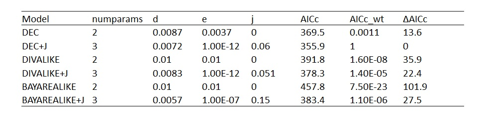

# Phylogenetic Biology - Final Project

# Biogeography of neotropical anurans of the subfamily Leptodactylinae in Brazil

## Introduction and Goals
Lineages that are widespread over large and heterogeneous areas often exhibit phenotypic divergence throughout their geographical range. Although some of this divergence may be the result of genetic drift, different environmental conditions across the range present different selective pressures that can ultimately lead to  phenotypic evolution as a result of differential fitness associated with trait variation. Amphibians are ectothermic animals with permeable skins, and therefore they must behaviorally and physiologically maintain their hydrothermal balance in order to persist in an area. Physiological evolution is a complex process and may be influenced by constrains arising from adaptations of the organism's ancestors to their original range. Therefore, understanding the biogeographic history of lineages is very important when investigating its physiological evolution. Species in this subfamily are widespread and occur from southern North America to southern South America, in Brazil there are representatives of this lineage in all six recognized biomes - Amazon, Cerrado, Caatinga, Pampa, Atlantic Forest and Pantanal (Figure 1).

.
**Figure 1** Map of the six Brazilian biomes.

The Amazon and the Atlantic forest are two disjunct neotropical forests currently separated by the Dry Diagonal (Caatinga and Cerrado), but they have been connected by forest bridges many times since the lifting of the Andes 45 million years ago as evidenced by pollen analyses, niche modelling, and splits between lineages inhabiting both forests. Many lineages occur both in the Amazon and Atlantic forests, and phylogeographic work has demonstrated a series of colonization events; from tens of millions of years ago through the late Pleistocene. The two rainforests extend through large geographical areas and encompass a suite of temperature and precipitation conditions, which makes these forests an ideal system to test hypotheses about physiological evolution. With information about the geographical origin, distribution, and ecology of widespread lineages of anurans throughout these regions, we can ask how thermal and water balance physiology has responded to, or itself influenced the evolution of these lineages. The objective of this project was to model the biogeographic history of the widespread subfamily of neotropical anurans Leptodactylinae, to create a phylogenetic framework to investigate their physiological evolution.

The goal of my project was to identify taxa from a widespread neotropical subfamily of anurans (Leptodactylinae) that colonized the Atlantic forest (AT) from the Amazon (AM), to create a phylogenetic framework to investigate their physiological evolution. To do that I used phylogenetic comparative methods to infer the biogeographic history of tips, with particular interest in the colonization events that happened from the AM to the AF. I used a time calibrated phylogenetic tree from my target taxa obtained from vertlife.org. Occurrence data for all available taxa of interest will be downloaded from the public repositories GBIF, IDIGBIO, and Vertnet, and imported into ArcMap. I will use shapefiles from the major South American ecoregions as defined by Olson et al. (2001) to assign taxa of interest to the ecoregions which they occupy. Then I will use the r package BioGeoBEARS to test different models for the biogeographic history of Leptodactylidae, and select the best supported tree using AIC scores. The phylogenetic tree obtained from that analysis will include ancestral range reconstructions, which allow inferring instances of colonization of the AF by AM lineages. The selective pressures to which organisms are exposed vary according to their geographic distributions, particularly for anurans, which depend on a delicate hydrothermal balance to maintain their activity and metabolism. Understanding the biogeographic history of anurans is therefore very important to understand the evolution of their physiological traits under different climatic conditions.

## Methods

### Data acquisition and management
I downloaded 100 time calibrated phylogenetic trees for the subfamily Leptodactylinae from vertlife.org and obtained a consensus tree using package ape in r. The resulting tree was mostly composed of polytomies, with only the genus *Adenomera* and its sister group *Lithodytes lineatus* being recovered in all trees. Due to the large discrepancies across trees I opted to use a randomly selected tree from the posterior distribution for further biogeographic analyses.
I downloaded publicly available data for anurans of the family Leptodactylidae from idigbio.com. The raw file contained 6120 records. I selected only taxa that belong to the subfamily Leptodactylinae and removed records that were not identified to the species level (e.g. genus only) using the r package dplyr. Then I used the r package CoordinateCleaner to remove records that did not have coordinate data, and flag records that might represent mistakes. The resulting table contained 2873 records.
I pruned the Leptodactylinae tree, which originally contained 99 species to include only taxa for which georeferenced coordinates were available, and obtained a final tree that contained 53 terminal taxa .  

### Biome character states for terminal taxa
I obtained a publicly available Brazilian biomes shapefile from ibge.gov. I imported georeferenced coordinates for anurans in QGIS and used the spatial join tool to extract biome data for each of the anuran records.

### Biogeographic analysis
I used the BioGeoBEARS package in r to fit 3 different biogeographic models to the data: DEC, DIVAlike and BayArea, all models were run with or without the founder-event speciation, represented by parameter J. I compared models with corrected AIC (Akaike information criterion) to account for possible effects of sample size.

## Results

The most supported model was DEC+J (Table 1), so subsequent data visualization and interpretation was derived from the results from that model.

**Table 1**

**Figure 2**

**Figure 3**

## Discussion

These results indicate...

The biggest difficulty in implementing these analyses was...

If I did these analyses again, I would...

## References

Antonelli, A., Zizka, A., Antunes Carvalho, F., Scharn, R., Bacon, C.D., Silvestro, D., and Condamine, F.L. 2018. Amazonia is the primary source of Neotropical biodiversity. Proceedings of the National Academy of Sciences 115:6034–6039.

Fouquet, A., Santana Cassini, C., Fernando Baptista Haddad, C., Pech, N., and Trefaut Rodrigues, M. 2014. Species delimitation, patterns of diversification and historical biogeography of the Neotropical frog genus Adenomera (Anura, Leptodactylidae). Journal of Biogeography 41:855–870.

Matzke, N.J. 2013. Probabilistic historical biogeography: new models for founder‐event speciation, imperfect detection, and fossils allow improved accuracy and model‐testing. Frontiers of Biogeography 5:242–248.

Ree, R.H., and Sanmartin, I. 2018. Conceptual and statistical problems with the DEC+J model of founder-event speciation and its comparison with DEC via model selection. Journal of Biogeography 45:741–749.

Sá, R.O. de, Grant, T., Camargo, A., Heyer, W.R., and Ponssa, M.L. 2014. Systematics of the Neotropical Genus Leptodactylus Fitzinger, 1826 (Anura: Leptodactylidae): Phylogeny, the Relevance of Non-molecular Evidence, and Species Accounts. South American Journal of Herpetology 9:S1–S128.

Santos, J.C., Coloma, L.A., Summers, K., Caldwell, J.P., Ree, R., and Cannatella, D.C. 2009. Amazonian Amphibian Diversity Is Primarily Derived from Late Miocene Andean Lineages. PLoS Biology 7:0448–0461.
